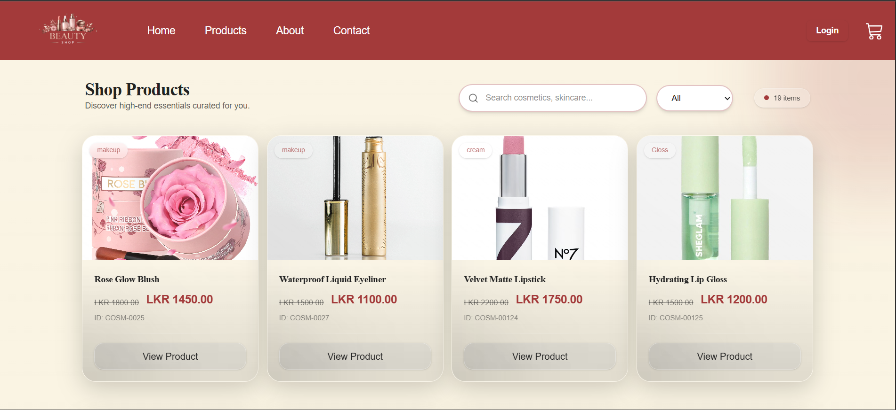
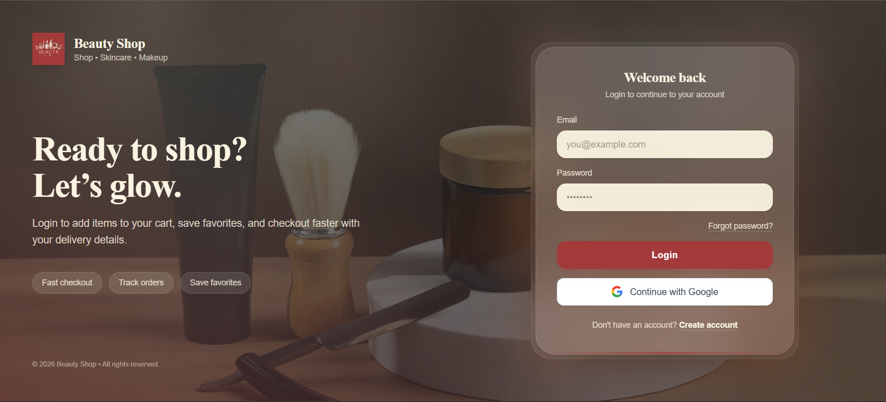
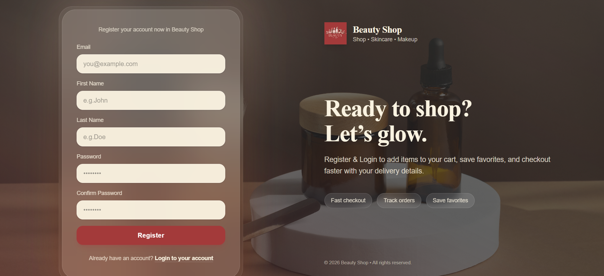

# 💄 Cosmetic Site - Frontend
[](https://reactjs.org/)
[](https://vitejs.dev/)
[](https://tailwindcss.com/)

This is the modern, responsive user interface for the **Cosmetic Site**, built with **React**. It features a clean design, seamless navigation, and real-time interaction with the [Cosmetic Site Backend](https://github.com/tharushainduwara/cosmetic-site-backend.git).

---

## ✨ Features

* **Responsive Design:** Fully optimized for Mobile, Tablet, and Desktop views.
* **Product Showcase:** Dynamic grid layout for browsing beauty and cosmetic products.
* **User Authentication:** Integrated Login/Signup forms with persistent session handling.
* **Product Filtering:** Interactive category and search filters to find specific items.
* **Shopping Cart:** Real-time cart management (Add, Remove, Update quantities).
* **Toast Notifications:** Instant feedback for user actions (Success, Error, Info).
* **Secure API Integration:** Connected to a RESTful Node.js/Express backend.

---

## 🖼️ Screenshots

### 🏠 Home Page


### 🛍️ Products Page


### 🔐 Login Page


### 📝 Sign Up Page


---

## 🛠️ Tech Stack

* **Library:** React.js
* **Styling:** Tailwind CSS / CSS Modules
* **Routing:** React Router DOM
* **State Management:** Context API (or Redux if applicable)
* **HTTP Client:** Axios / Fetch API
* **Build Tool:** Vite / Create React App

---

## 📂 Project Structure

```text
├── public/             # Static assets (images, icons)
├── src/
│   ├── assets/         # Project-specific images/styles
│   ├── components/     # Reusable UI components (Navbar, Footer, ProductCard)
│   ├── context/        # State management (AuthContext, CartContext)
│   ├── hooks/          # Custom React hooks
│   ├── pages/          # Main views (Home, Login, ProductDetails, Cart)
│   ├── services/       # API calling functions (Axios instances)
│   ├── utils/          # Helper functions and constants
│   ├── App.jsx         # Main application component
│   └── main.jsx        # Entry point
├── .env                # Environment variables
└── package.json        # Dependencies and scripts
```
